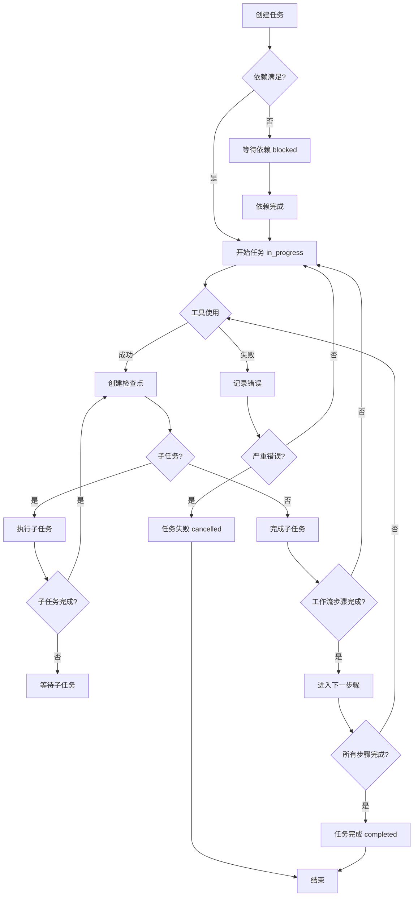

# P0 优化实现方案

## 1. 开源项目研究

### 1.1 Claude Code 官方 Tasks 系统分析

**核心架构：**
- 文件系统存储：任务持久化在 `~/.claude/tasks/` 目录
- 跨会话协作：通过环境变量 `CLAUDE_CODE_TASK_LIST_ID` 共享任务列表
- 依赖关系：支持任务间的阻塞关系（blocks, parent-child, related）
- 状态管理：pending → in_progress → completed → closed
- 实时广播：多个 session 自动同步状态变化

**关键特性：**
- **持久化存储**：即使重启电脑，任务依然存在
- **依赖图管理**：自动计算就绪任务，避免乱序执行
- **多代理协作**：多个 Claude 实例共享任务状态
- **状态生命周期**：清晰的工作流状态转换

### 1.2 Beads 任务管理系统分析

**核心设计理念：**
- Git as Database：使用 Git 作为分布式数据库
- 双存储写屏障：SQLite + JSONL 保证性能与版本控制
- 自适应哈希 ID：平衡可读性与全局唯一性
- Blocked Issues Cache：25倍性能提升

**核心组件：**
- CLI Layer：命令行接口
- Daemon Process：后台守护进程
- Storage Layer：支持多种存储后端

**依赖管理：**
- blocks：阻塞依赖
- parent-child：层级关系
- related：软链接
- discovered-from：任务溯源

### 1.3 Claude-Flow Hive-Mind 系统

**架构特点：**
- 女王代理（Queen）：整体协调
- 工作代理（Worker Agents）：专业化执行
- 内存系统（Memory）：SQLite持久化
- 通信层：代理间无缝协作

**拓扑结构：**
- 网状、分层、环形、星型
- 自动选择最优协调策略

## 2. 多任务并行方案

### 2.1 数据结构设计

```typescript
// .claude/task/.active-tasks.json
{
  "task_list_id": "dev-workflow-2026-03-03",
  "created_at": "2026-03-03T10:00:00Z",
  "last_updated": "2026-03-03T12:00:00Z",
  "active_tasks": [
    {
      "id": "task_001",
      "name": "实现用户认证功能",
      "status": "in_progress",
      "created_at": "2026-03-03T10:00:00Z",
      "started_at": "2026-03-03T10:30:00Z",
      "estimated_duration": "2h",
      "assigned_agent": "main",
      "priority": "high",
      "dependencies": [],
      "blocked_by": [],
      "subtasks": ["subtask_001", "subtask_002"]
    },
    {
      "id": "task_002",
      "name": "设计数据库结构",
      "status": "completed",
      "created_at": "2026-03-03T09:00:00Z",
      "completed_at": "2026-03-03T11:00:00Z",
      "assigned_agent": "database-expert",
      "priority": "high",
      "dependencies": [],
      "blocked_by": [],
      "subtasks": []
    }
  ]
}

// 任务目录结构
.claude/task/
├── .active-tasks.json      # 活动任务列表
├── 2026-03-03-功能A/
│   ├── .task-state.json     # 任务状态快照
│   ├── .workflow-state.json # 工作流步骤状态
│   ├── .memory/            # 任务记忆存储
│   │   ├── decisions.json  # 决策日志
│   │   ├── findings.json   # 发现记录
│   │   └── errors.json     # 错误记录
│   ├── checkpoints/         # 检查点文件
│   │   ├── phase1.yaml     # 第1阶段检查点
│   │   └── phase2.yaml     # 第2阶段检查点
│   └── outputs/            # 中间产物
│       ├── design/         # 设计文档
│       ├── code/           # 代码产物
│       └── tests/          # 测试产物
└── 2026-03-03-功能B/
    ├── .task-state.json
    └── ...
```

### 2.2 状态管理

**任务状态：**
- `pending`：待开始，依赖未满足
- `in_progress`：正在进行中
- `blocked`：被阻塞
- `completed`：已完成
- `deferred`：延期
- `cancelled`：已取消

**工作流步骤状态：**
- `not_started`：未开始
- `in_progress`：进行中
- `completed`：已完成
- `requires_review`：需要审核

### 2.3 钩子集成

**SessionStart 钩子：**
```typescript
// .claude/hooks/SessionStart.ts
interface TaskManager {
  loadActiveTasks(): Promise<ActiveTasks>;
  getCurrentTask(): Task | null;
  startTask(taskId: string): void;
  completeTask(taskId: string): void;
}

const taskManager = new TaskManager();
const currentTask = taskManager.getCurrentTask();

if (currentTask) {
  displayCurrentTask(currentTask);
  displayTaskDependencies(currentTask);
}
```

**PreToolUse 钩子：**
```typescript
// .claude/hooks/PreToolUse.ts
interface ToolUseContext {
  tool: string;
  task: Task;
  workflowStep: string;
}

function validateToolUse(context: ToolUseContext) {
  if (context.task.status === 'completed') {
    throw new Error('Cannot use tools on completed task');
  }

  if (context.workflowStep === 'code_development' &&
      !taskManager.isSubtaskAllowed(context.task)) {
    throw new Error('Subtask not allowed in current workflow phase');
  }
}
```

**PostToolUse 钩子：**
```typescript
// .claude/hooks/PostToolUse.ts
interface ToolResult {
  tool: string;
  success: boolean;
  output: any;
}

function saveToolResult(result: ToolResult) {
  if (result.success) {
    taskManager.saveOutput(result.tool, result.output);
    taskManager.createCheckpoint();
  } else {
    taskManager.logError(result.tool, result.output);
  }
}
```

## 3. 状态持久化方案

### 3.1 检查点设计

**检查点级别：**
```typescript
interface Checkpoint {
  id: string;
  task_id: string;
  workflow_step: string;
  timestamp: string;
  data: CheckpointData;
  metadata: CheckpointMetadata;
}

// 数据结构
interface CheckpointData {
  conversation_history: ConversationMessage[];
  files_modified: FileChange[];
  decisions_made: Decision[];
  context_variables: Record<string, any>;
}

// 元数据
interface CheckpointMetadata {
  token_usage: TokenUsage;
  session_duration: number;
  last_modified: string;
  checksum: string;
}
```

**检查点策略：**
1. **自动检查点**：
   - 工作流步骤完成后
   - 每完成一个子任务
   - 定时检查点（每30分钟）

2. **手动检查点**：
   - 关键决策点
   - 用户请求

### 3.2 恢复机制

**恢复流程：**
```typescript
class TaskRecovery {
  async restoreFromCheckpoint(taskId: string, checkpointId?: string) {
    // 1. 加载最近检查点
    const checkpoint = checkpointId
      ? await this.loadCheckpoint(checkpointId)
      : await this.loadLatestCheckpoint(taskId);

    // 2. 重建上下文
    await this.restoreContext(checkpoint);

    // 3. 恢复文件状态
    await this.restoreFiles(checkpoint.files_modified);

    // 4. 显示恢复信息
    this.showRecoveryInfo(checkpoint);
  }

  async restoreContext(checkpoint: Checkpoint) {
    // 恢复对话历史
    this.loadConversationHistory(checkpoint.conversation_history);

    // 恢复决策记录
    this.restoreDecisions(checkpoint.decisions_made);

    // 恢复工作流状态
    this.restoreWorkflowState(checkpoint.workflow_step);
  }
}
```

### 3.3 数据结构

**任务记忆存储：**
```typescript
interface TaskMemory {
  task_id: string;
  decisions: Decision[];
  findings: Finding[];
  errors: ErrorRecord[];
  lessons: Lesson[];

  // 序列化方法
  serialize(): string;
  deserialize(data: string): void;
}

interface Decision {
  id: string;
  timestamp: string;
  context: string;
  decision: string;
  reasoning: string;
  alternatives: string[];
  outcome?: string;
}

interface Finding {
  id: string;
  timestamp: string;
  category: 'architecture' | 'code' | 'performance';
  content: string;
  source: 'analysis' | 'experiment';
  importance: 'high' | 'medium' | 'low';
}
```

**错误记录：**
```typescript
interface ErrorRecord {
  id: string;
  task_id: string;
  timestamp: string;
  tool: string;
  error_type: string;
  message: string;
  stack_trace?: string;
  context: Record<string, any>;
  resolved_at?: string;
  resolution?: string;
}
```

## 4. 实现建议

### 4.1 核心组件架构

```typescript
// 任务管理器核心
class TaskManager {
  private activeTasks: ActiveTasks;
  private checkpoints: Map<string, Checkpoint>;
  private memoryStore: MemoryStore;

  constructor() {
    this.activeTasks = new ActiveTasks();
    this.checkpoints = new Map();
    this.memoryStore = new MemoryStore();
  }

  // 任务生命周期
  createTask(config: TaskConfig): Task;
  startTask(taskId: string): void;
  completeTask(taskId: string): void;
  cancelTask(taskId: string): void;

  // 依赖管理
  addDependency(taskId: string, dependsOn: string): void;
  removeDependency(taskId: string, dependsOn: string): void;

  // 检查点管理
  createCheckpoint(taskId: string): Checkpoint;
  restoreFromCheckpoint(taskId: string): void;
}

// 工作流引擎
class WorkflowEngine {
  private taskManager: TaskManager;
  private currentWorkflow: Workflow;

  executeWorkflow(workflow: Workflow): Promise<void>;
  advanceToNextStep(): void;
  checkCompletionCriteria(): boolean;
}

// 状态持久化
class PersistenceManager {
  saveState(state: AppState): Promise<void>;
  loadState(taskId: string): Promise<AppState>;
  createBackup(): Promise<string>;
  restoreFromBackup(backupId: string): Promise<void>;
}
```

### 4.2 状态转换图



### 4.3 关键代码示例

**任务创建：**
```typescript
async function createTask(taskConfig: TaskConfig): Promise<Task> {
  const taskId = generateTaskId();
  const task: Task = {
    id: taskId,
    name: taskConfig.name,
    description: taskConfig.description,
    status: 'pending',
    priority: taskConfig.priority || 'medium',
    dependencies: taskConfig.dependencies || [],
    subtasks: [],
    memory: {
      decisions: [],
      findings: [],
      errors: []
    },
    createdAt: new Date().toISOString(),
    workflowStep: taskConfig.initialWorkflowStep
  };

  // 保存到活动任务列表
  taskManager.addTask(task);

  // 创建初始检查点
  const checkpoint = taskManager.createCheckpoint(taskId);

  return task;
}
```

**依赖检查：**
```typescript
function checkDependencies(taskId: string): boolean {
  const task = taskManager.getTask(taskId);
  if (!task) return false;

  // 检查所有依赖是否已完成
  for (const depId of task.dependencies) {
    const depTask = taskManager.getTask(depId);
    if (depTask?.status !== 'completed') {
      return false;
    }
  }

  return true;
}
```

**状态持久化：**
```typescript
async function persistTaskState(task: Task): Promise<void> {
  const state = {
    task: task,
    timestamp: new Date().toISOString(),
    checksum: calculateChecksum(task)
  };

  // 保存到文件系统
  await fs.writeFile(
    `.claude/task/${task.id}/.task-state.json`,
    JSON.stringify(state, null, 2)
  );

  // 更新内存中的状态
  taskManager.updateTask(task);
}
```

### 4.4 与现有钩子系统集成

**工作流步骤跟踪：**
```typescript
// .claude/hooks/PreToolUse.ts
export async function onPreToolUse({ tool, args }) {
  const currentTask = taskManager.getCurrentTask();
  const workflowStep = getCurrentWorkflowStep();

  // 记录工具使用
  await taskManager.logToolUsage({
    task_id: currentTask.id,
    tool: tool,
    args: args,
    timestamp: new Date().toISOString()
  });

  // 创建定时检查点
  const timeSinceLastCheckpoint = Date.now() - lastCheckpointTime;
  if (timeSinceLastCheckpoint > CHECKPOINT_INTERVAL) {
    await taskManager.createCheckpoint(currentTask.id);
  }
}
```

**任务完成处理：**
```typescript
// .claude/hooks/Stop.ts
export async function onStop() {
  const currentTask = taskManager.getCurrentTask();

  if (currentTask && currentTask.status === 'in_progress') {
    // 保存最终状态
    await persistTaskState(currentTask);

    // 如果需要，创建新的任务
    if (hasPendingTasks()) {
      const nextTask = getNextTask();
      await taskManager.startTask(nextTask.id);
      displayNextTask(nextTask);
    }
  }

  // 清理资源
  await cleanupResources();
}
```

## 5. 总结

本方案基于 Claude Code 官方 Tasks 系统和 Beads 项目的最佳实践，提供了完整的任务并行管理和状态持久化解决方案。核心优势包括：

1. **多任务并行**：通过依赖关系图自动管理任务执行顺序
2. **状态持久化**：支持中断恢复，确保工作连续性
3. **智能检查点**：自动保存关键状态，减少重复工作
4. **钩子集成**：与现有 dev-workflow 无缝集成
5. **可扩展架构**：支持未来功能扩展

通过实施本方案，dev-workflow 将具备处理复杂项目的能力，支持长期任务管理和团队协作。